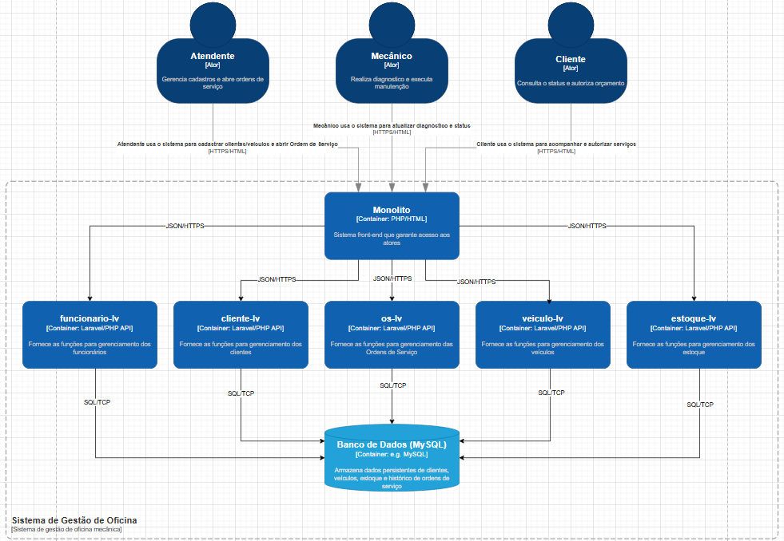
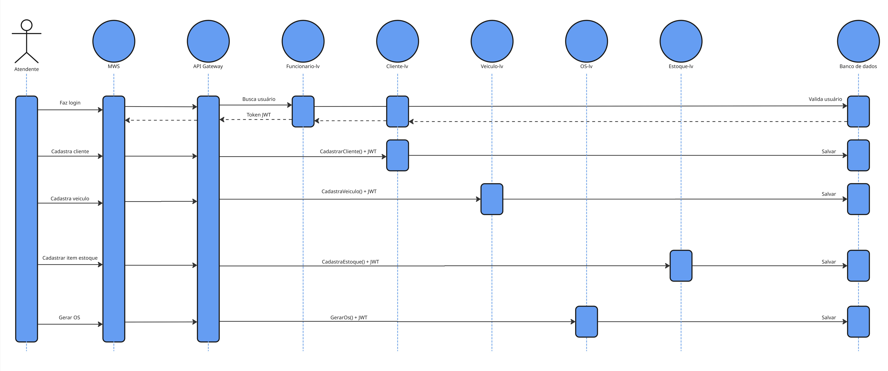
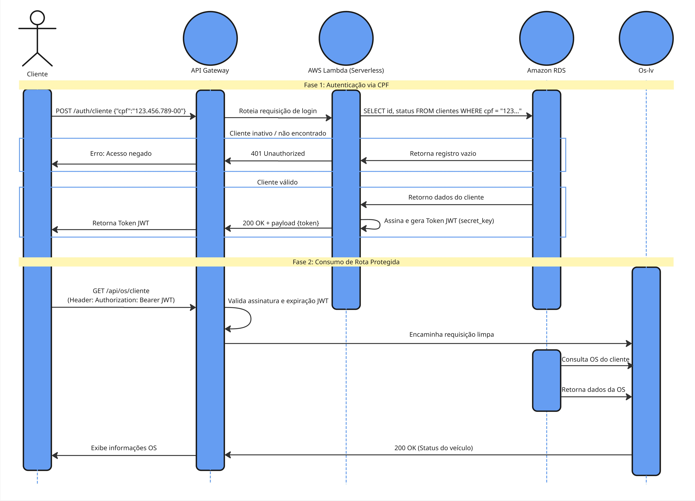
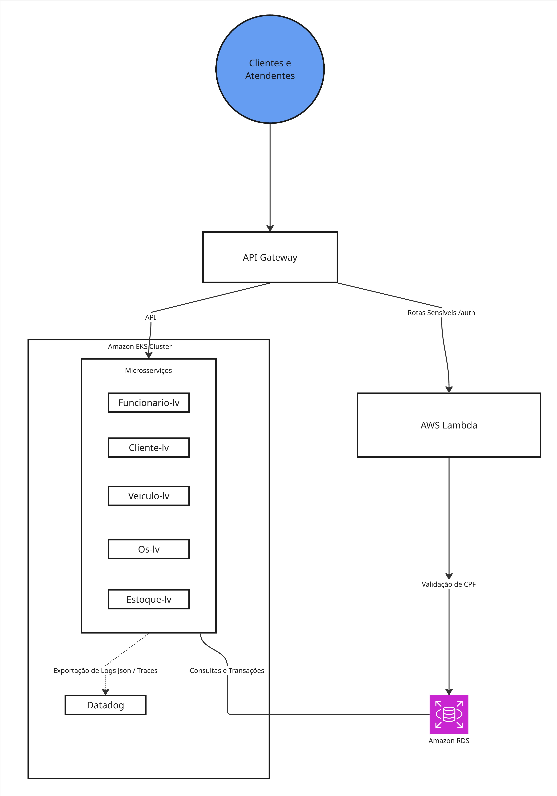

# MWS - Aplicação e Microsserviços
### MVP - Tech Challenge


Sistema projetado para a solução operacional de oficinas mecânicas, focando na rastreabilidade total do ciclo de vida de uma manutenção, desde a entrada do veículo até a entrega final com disparos automáticos de e-mail.

Este repositório contém o código-fonte principal (Microsserviços Laravel) do sistema de gestão MWS

### Arquitetura e Tecnologias
A solução foi decomposta em contêineres independentes para garantir alta coesão e isolamento de domínios (Bounded Contexts).
* **Linguagem:** PHP 8.4 (Laravel Framework nas APIs) e PHP Puro (Front-end)
* **Banco de Dados:** MySQL 8.0 (Persistência) e SQLite (Testes)
* **Orquestração:** Docker, Docker Compose e Kubernetes (K8s)
* **Mensageria & Notificações:** SMTP interceptado via MailHog
* **Padrões:** DDD (Domain Driven Design), Arquitetura Hexagonal, Clean Code.

---

### Ecossistema de Microsserviços e Front-end: 
- **Monólito (Front-end):** Interface de usuário centralizada em PHP que consome o ecossistema de APIs via JWT.
- **Cliente-lv:** Gestão de cadastro de clientes.
- **Veiculo-lv:** Gestão de frota e vínculos com clientes.
- **Funcionario-lv:** Gestão de colaboradores e autenticação JWT.
- **Estoque-lv:** Controle de peças e insumos.
- **Os-lv:** Core Domain - Gestão de Ordens de Serviço, transições de status e disparos de e-mail ao cliente.
  
---

## 🌐 Organização do Ecossistema (4 Repositórios)
Para atender aos requisitos de desacoplamento, segurança e responsabilidade única, o projeto está estruturado em 4 repositórios distintos:

| Componente | Repositório | Descrição do Componente |
| :--- | :--- | :--- |
| **MWS (Este)** | `mws-app` | Código-fonte dos microsserviços (PHP/Laravel), Dockerfiles e manifestos K8s. |
| **MWS-Serverless** | `mws-serverless-auth` | Função AWS Lambda para validação de CPF e geração de Token JWT. |
| **MWS-Infra-K8s** | `mws-infra-k8s` | Código Terraform para provisionamento do cluster Amazon EKS e API Gateway. |
| **MWS-Infra-DB** | `mws-infra-db` | Código Terraform para provisionamento do banco de dados Amazon RDS. |

---

## ⚙️ Arquitetura e Decisões Técnicas (RFCs e ADRs)
A arquitetura foi desenhada para suportar alto tráfego com isolamento de falhas, documentada através de RFCs e ADRs:

* **API Gateway & Serverless Offloading [(ADR 001)](https://app.notion.com/p/ADR-001-Implementa-o-de-API-Gateway-e-Offloading-de-Autentica-o-3d5b36cb511a8013a4b7f6f0048dced4?source=copy_link):** Roteamento e controle de tráfego na borda da nuvem. Rotas sensíveis exigem autenticação via CPF tratada em função Serverless (AWS Lambda), liberando o cluster Kubernetes de processar requisições inválidas.
* **Orquestração e Contêineres:** Cluster **Amazon EKS** executando os microsserviços isolados por domínios (DDD / Clean Architecture).
* **Persistência de Dados [(RFC 001)](https://app.notion.com/p/RFC-001-Ado-o-de-Banco-de-Dados-Relacional-Gerenciado-Amazon-RDS-MySQL-3d5b36cb511a802c9012dcace75197c5?source=copy_link):** Banco de dados gerido **Amazon RDS (MySQL 8.0)** em sub-rede privada (VPC). A escolha do modelo relacional garante a consistência transacional (ACID) necessária para Ordens de Serviço, Clientes, Estoque e Faturamento.

---
## Diagramas de Sequência e Componentes
Diagrama de Sequência - Gerar OS

Diagrama de Sequência - Autenticação

Diagrama de Componentes


---

## 📊 Monitoramento, Observabilidade e Dashboards (ADR 002)
A aplicação possui suporte nativo a ferramentas de Application Performance Monitoring (APM - Datadog / New Relic):

* **Métricas de Infraestrutura e APM:** Acompanhamento em tempo real de latência das APIs, consumo de CPU e memória do Kubernetes, disponibilidade do cluster e healthchecks (`/api/ping`).
* **Logs Estruturados (JSON):** Formatação padronizada do Monolog/Laravel em JSON para indexação e busca otimizada.
* **Tracing Distribuído (`correlationId` / `traceId`):** Injeção de identificador único de correlação no cabeçalho das requisições para rastreio end-to-end (API Gateway -> AWS Lambda -> EKS -> Amazon RDS).
* **Dashboards Executivos:** Métricas de negócio incluindo volume diário de Ordens de Serviço, tempo médio de execução por status e taxa de erros em integrações.

[(Link de acesso a ADR 002)](https://app.notion.com/p/ADR-002-Implementa-o-de-Observabilidade-e-Monitoramento-Centralizado-3d5b36cb511a80c8bdcac013e19c08ac?source=copy_link)

---

## 🔄 Pipeline de CI/CD e Governança de Código
Este repositório utiliza automação completa via **GitHub Actions**.

Fluxo:

1. Pull Request / Push na branch main
2. Execução dos testes automatizados
3. Build das imagens Docker
4. Publicação no Amazon ECR
5. Deploy automático no Amazon EKS via kubectl set image

* **Proteção de Branches:** A branch `main` é protegida contra commits diretos. Qualquer alteração deve obrigatoriamente ser submetida via **Pull Request (PR)** com validação de pipeline.
* **Etapas do CI/CD (Pipeline da Aplicação):**
  1. **Análise de Qualidade e Segurança:** Execução de suíte de testes unitários/integração e verificação de vulnerabilidades (`composer audit`).
  2. **Build da Imagem:** Compilação da imagem Docker baseada no `Dockerfile` otimizado do repositório.
  3. **Publish:** Envio e tagueamento da imagem no container registry (Amazon ECR / Docker Hub).
  4. **Deploy Automatizado:** Atualização do deployment no cluster Kubernetes de Homologação/Produção via `kubectl set image`.
 
Tecnologias:

- GitHub Actions
- Docker
- Amazon ECR
- Amazon EKS

---

## Como executar o projeto
### Opção 1: Ambiente Local (Docker Compose)
Na raiz do projeto execute: <br>
`docker-compose up -d`
  
### Configurar os Bancos de Dados e Seeders
Foi criado um script de setup automatizado que executa todas as migrations e cria um usuário administrador padrão execute: <br>
`chmod +x setup.sh` <br>
`./setup.sh` <br>

## Como executar o projeto
### Opção 2: Ambiente Clusterizado (Kubernetes)
Para deploy no cluster Kubernetes (Minikube ou EKS), aplique os manifests da pasta k8s/ <br>
`kubectl apply -f k8s/` <br>

Para acessar o painel de interceptação de e-mails de desenvolvimento, redirecione a porta do MailHog:
`kubectl port-forward svc/mailhog 8025:8025`
  
### Credenciais de acesso
Para testar os endpoints que exigem autenticação: <br>
`Usuário: admin` <br>
`Senha: admin123` <br>

## Testes Automatizados
Garantimos uma cobertura de testes superior a 80% em todos os domínios. Para rodar os testes de um módulo específico: <br>
`docker exec -it cliente-lv-api php artisan test` <br>
`docker exec -it estoque-lv-api php artisan test `<br>
`docker exec -it funcionario-lv-api php artisan test` <br>
`docker exec -it os-lv-api php artisan test` <br>
`docker exec -it veiculo-lv-api php artisan test` <br>

## Análise de Vulnerabilidades:

- Validação contínua via composer audit.
- Status Atual: 0 vulnerabilidades críticas encontradas no código de produção.

---

## 🚀 Instruções de Execução e Deploy

> **Nota de Contingência Arquitetural:** Devido à limitação/expiração dos créditos da conta de laboratório da AWS Academy durante o ciclo de desenvolvimento, os manifestos de infraestrutura e aplicação foram validados localmente utilizando o Kubernetes (Docker Desktop) como ambiente de fallback funcional para a gravação da demonstração.

### Pré-requisitos
* `kubectl` instalado e configurado.
* Docker Desktop com Kubernetes habilitado ou cluster K8s ativo.

### Passos para Deploy em Cluster
1. Aplique os manifestos unificados dos serviços no Kubernetes:
   ```bash
   kubectl apply -f mws-apps.yaml
   ```
2. Verifique se os Pods estão em execução:
   ```bash
   kubectl get pods -w
   ```
3. Realize o port-forward para expor localmente a API desejada (exemplo da API de Funcionários):
   ```bash
   kubectl port-forward service/funcionario-api 8004:80
   ```
4. Teste os endpoints no Postman utilizando ```http://localhost:8004/api/ping``` com o cabeçalho ```Accept: application/json```

---

### 📚 Documentação e APIs
A documentação completa, incluindo o Event Storming, Mapa de Contexto e Linguagem Ubíqua, pode ser acessada através do link abaixo:
[Acesse a Documentação no Notion](https://www.notion.so/TECH-CHALLENGE-338b36cb511a80cb9c12d5c70c5682c7?source=copy_link) <br>
[Endpoints (Postman)](https://gustavo-5520387.postman.co/workspace/Gustavo's-Workspace~e01e23b1-b0c9-4148-8bea-f931ea6d3628/collection/45952571-cfa04a96-15fd-4662-b65d-0e6b27d75d80?action=share&creator=45952571)

---

## 👨‍💻 Autor
- Gustavo Pirolo - Cientista da Computação & Junior Development Analyst
- Apelido do Servidor: Gustavo Pirolo - RM371637
